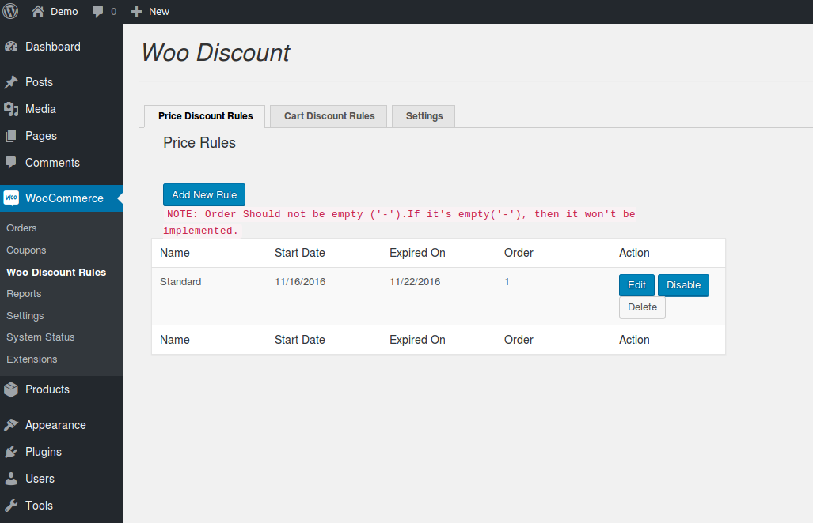
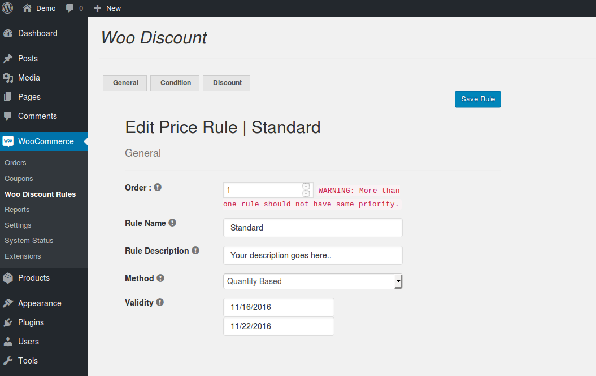
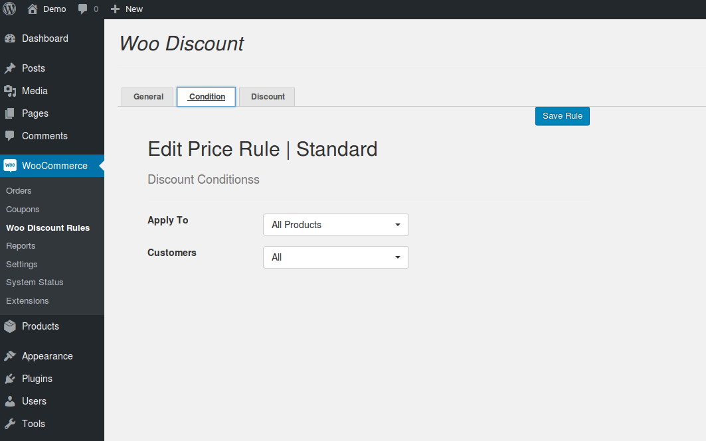
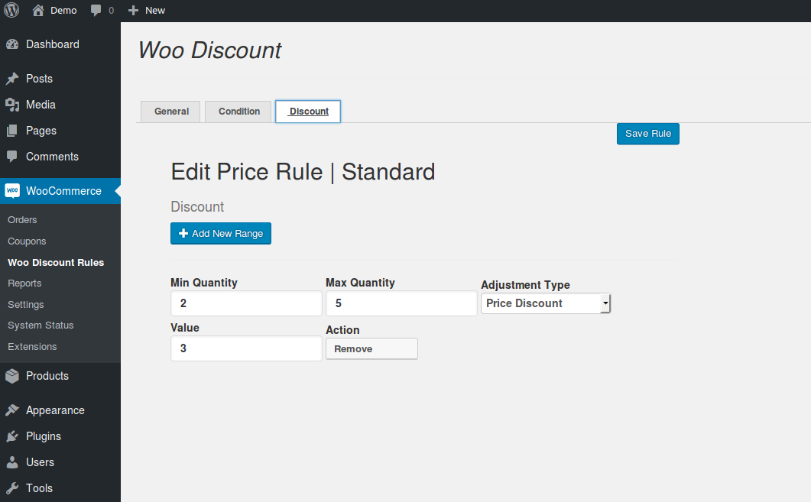
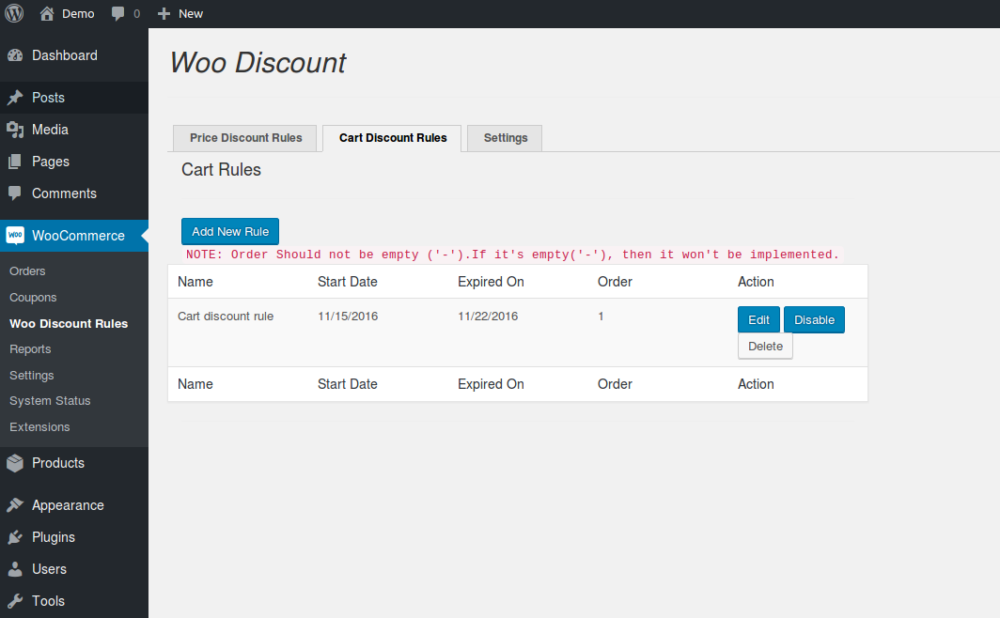
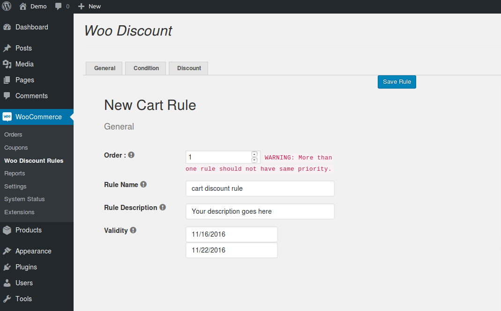
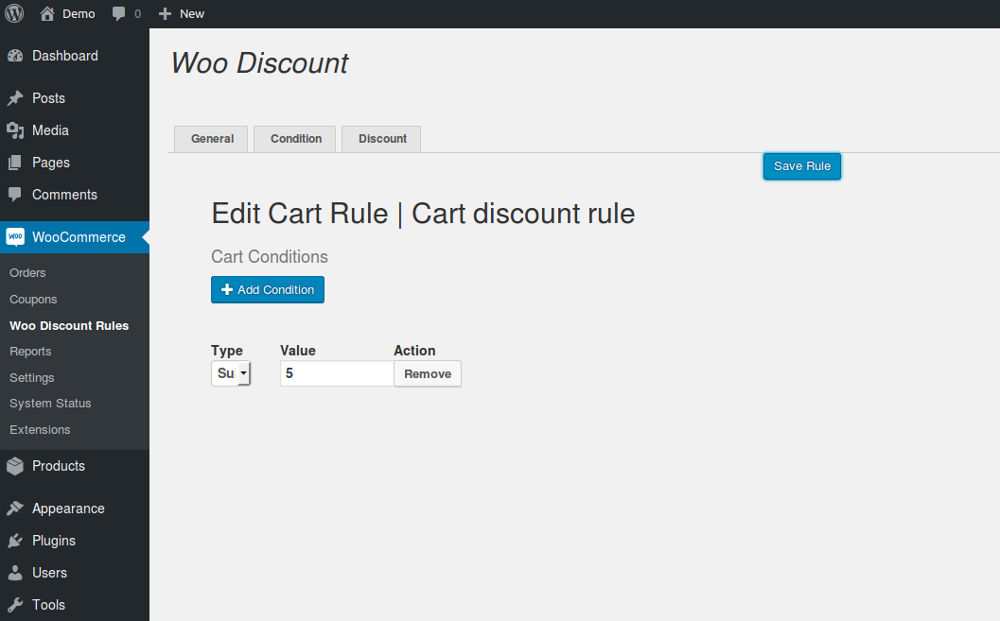
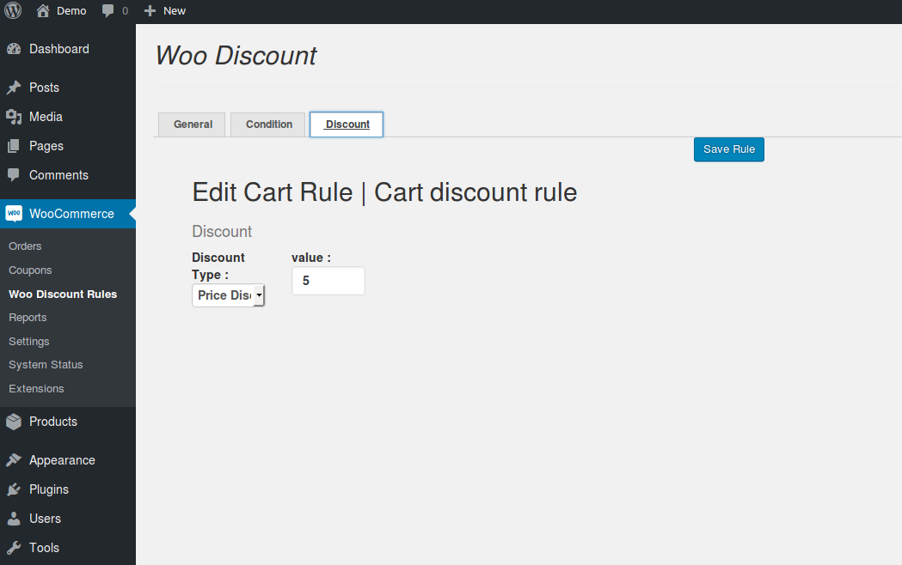
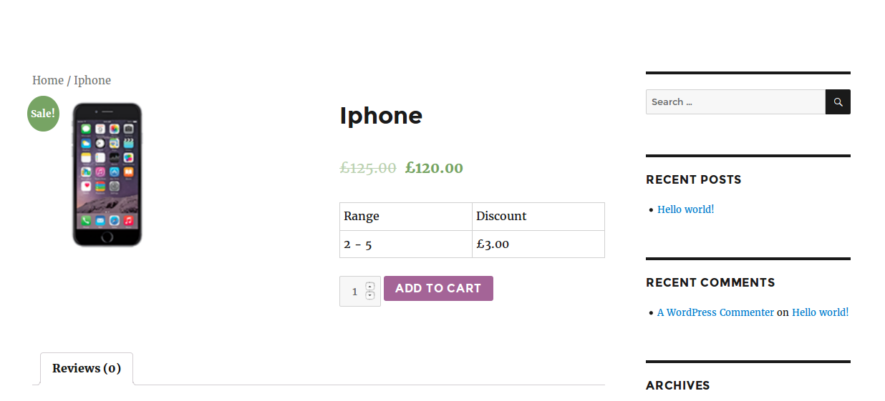
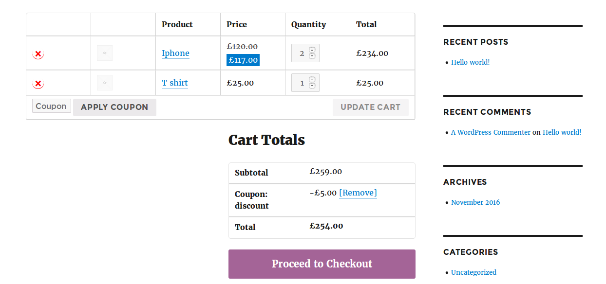

# Woo Discount Rules

Woo discount rules is a simpler add-on developed for woocommerce to apply discount rules based on cart quantity, item quantity, sub-total and more. Here you can define two kind of rules:

1. Price discount rules
2. Cart discount rules

## Price discount rules

### General

1. Order

Here you have to give the priority for the rules created inside Price discount rules. That is, choose which rule is going to implement first. For example, if you are having multiple rules, those rules will be applied based on the priority you have given.

> Note: More than one rule should not have same priority. It should be unique.

1. Rule Name

Enter the unique name for the rule.

1. Rule Description

Enter two line description about the rule.

1. Method

Choose the method to be applied. Default is "Quantity Based"

1. Validity

Choose the dates between which the discount is valid. 

### Condition

1. Apply To

Choose on what basis the discount should be applied. You can choose any one from the list (All Products, specific categories, specific products).

1. Customers

Choose whether the discount should apply to all customers or specific customer. 

### Discount

Here you have to define quantity range for discount.

1. Min Quantity and Max Quantity

Choose the quantity range between which the discount should apply.

1. Adjustment type

Choose your discount type here. You can choose either Percentage discount or price discount. For example, say 5% or $5.

1. Value

Enter the discount value in number. For example, 5. 

## Cart Discount Rules

### General

1. Order

Here you have to give the priority for the rules created inside Price discount rules. That is, choose which rule is going to implement first. For example, if you are having multiple rules, those rules will be applied based on the priority you have given.

> Note: More than one rule should not have same priority. It should be unique.

1. Rule Name

Enter the unique name for the rule.

1. Rule Description

Enter two line description about the rule.

1. Validity

Choose the dates between which the discount is valid. 

### Condition

1. Type

Choose the condition type for cart discount method. You can apply discount on following types of conditions sub-total basis, cart item count, Quantity sum, Customer Details.

1. Value

Enter the value for the condition in number. For example, 300\. So If you select the type **Subtotal less than** and entered the value **300**. The discount rule applies when condition matches **Subtotal less than 300**. 

### Discount

Choose the discount type and enter the discount value. For example, 5% or $5 

## Frontend

